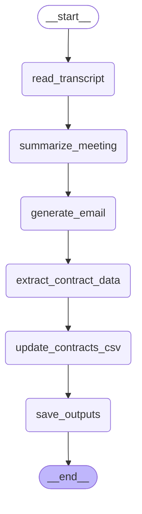

```mermaid
---
config:
  flowchart:
    curve: linear
---
graph TD;
	__start__([<p>__start__</p>]):::first
	read_transcript(read_transcript)
	summarize_meeting(summarize_meeting)
	generate_email(generate_email)
	extract_contract_data(extract_contract_data)
	update_contracts_csv(update_contracts_csv)
	save_outputs(save_outputs)
	__end__([<p>__end__</p>]):::last
	__start__ --> read_transcript;
	extract_contract_data --> update_contracts_csv;
	generate_email --> extract_contract_data;
	read_transcript --> summarize_meeting;
	summarize_meeting --> generate_email;
	update_contracts_csv --> save_outputs;
	save_outputs --> __end__;
	classDef default fill:#f2f0ff,line-height:1.2
	classDef first fill-opacity:0
	classDef last fill:#bfb6fc

```